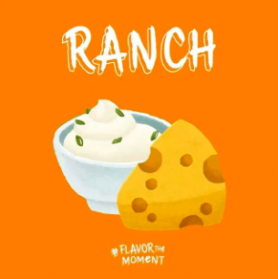
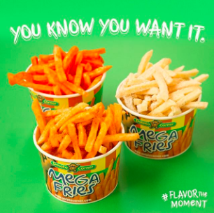
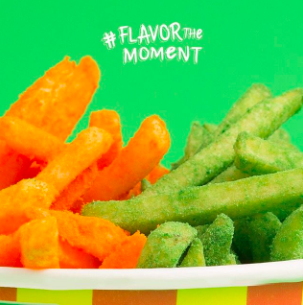

```{r setup, include=FALSE}
knitr::opts_chunk$set(echo = TRUE)
```

<link href="vendor/bootstrap/css/bootstrap.min.css" rel="stylesheet">

<link href="css/modern-business.css" rel="stylesheet">
    
<style>
h4, h5{
  color: SeaGreen ;
  font-family: Verdana;
}

p {
  font-family: Verdana;
  font-size: 13px;
}

.graybg {
  background-color: WhiteSmoke  ;
}

.withPadding{
  padding:2%;
}
</style>


<br><br>


<div class="withPadding">
  <h4 class="my-4" style="text-align:center">THE LATEST FROM POTATO CORNER</h4>
  <br>
  
  
  
  
</div>


<br><br>

<div class="graybg withPadding">
  <h4 class="my-4" style="text-align:center">FOLLOW US ON POTATO CORNER</h4>
  <br>
  <p  style="text-align:center">Feel the Flavor with everyone's favorite fries! Don't forget to tag us and show how you #FlavorTheMoment </p>
  <br>
  
  
  
  
</div>
