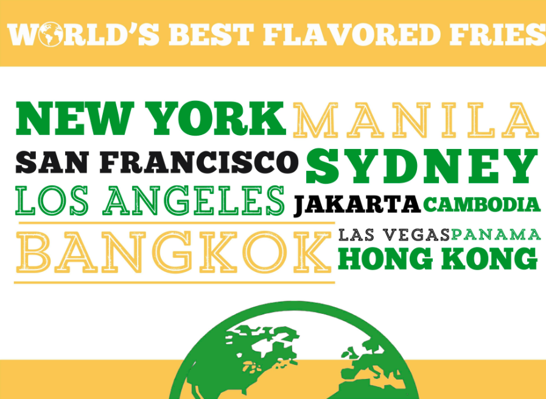

```{r setup, include=FALSE}
knitr::opts_chunk$set(echo = TRUE)
```

<style>
h4, h5{
  color: SeaGreen ;
  font-family: Verdana;
}

p {
  font-family: Verdana;
  font-size: 13px;
}

.graybg {
  background-color: WhiteSmoke  ;
}

.withPadding{
  padding:2%;
}
  
.center{
  display: block;
  margin-left: auto;
  margin-right: auto;
  width: 50%;margin-left: auto;
  margin-right: auto;
  width: 50%;
}

</style>

<h4 class="my-4">ABOUT US</h4>
<div class="graybg withPadding">
  <h5 class="my-4">HISTORY </h5>
  <br>
  <p>Potato Corner, dubbed as the <b>World’s Best Flavored Fries</b>, has been a leading brand in the food industry for 25 years with over <b>1,100 branches worldwide. </b></p>

  <p>Potato Corner opened its first outlet in the Philippines in October 1992 and began franchising the year after. Today, it has grown from small carts into in-line stores found in almost every corner of the world – in malls, schools, hospitals, bus stations, amusement parks, and even tourist destinations in multiple countries. In every corner of the world, someone wants Potato Corner. </p>

  <p>Throughout the years, Potato Corner has garnered numerous awards, mostly recognizing its excellent business model and well-loved brand. It has received the <b>Franchise Excellence Hall of Fame Award</b> by the Philippine Franchise Association and Department of Trade and Industry in 2003, won <b>Best Franchise of the Year</b> on three consecutive years, and most recently, bagged the <b>Global Franchise Award</b> recognized by the same institution. Potato Corner is truly an iconic brand for kids and kids-at-heart and a distinguished business venture for entrepreneurs. </p>
  <br>
  
  
</div>