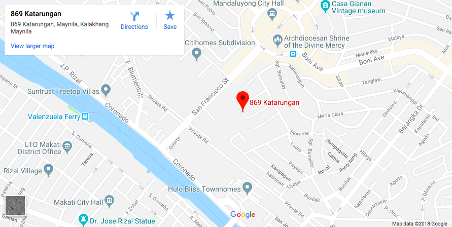

```{r setup, include=FALSE}
knitr::opts_chunk$set(echo = TRUE)
```
<style>
h4, h5{
  color: SeaGreen ;
  font-family: Verdana;
}

p {
  font-family: Verdana;
  font-size: 13px;
}

.graybg {
  background-color: WhiteSmoke  ;
}

.withPadding{
  padding:2%;
}
  
.center{
  display: block;
  margin-left: auto;
  margin-right: auto;
  width: 50%;margin-left: auto;
  margin-right: auto;
  width: 50%;
}

.select-style {
    border: 1px solid #ccc;
    width: 400px;
    border-radius: 3px;
    overflow: hidden;
    background: #fafafa url("img/icon-select.png") no-repeat 90% 50%;
}

.select-style select {
    padding: 5px 8px;
    width: 130%;
    border: none;
    box-shadow: none;
    background: transparent;
    background-image: none;
    -webkit-appearance: none;
}

.select-style select:focus {
    outline: none;
}

.navbar {
  color:green;
}
</style>

<link rel="stylesheet" href="https://www.w3schools.com/w3css/4/w3.css">
<br>
<h4 class="my-4">DROP US A LINE</h4>
<br>
<h5 class="my-4">Types of Inquiry: </h5>
<div class="select-style">
  <select>
    <option value="o1">Franchising Inquiry Philippines</option>
    <option value="o2">Franchising Inquiry International</option>
    <option value="o3">Sponsorship Request</option>
    <option value="o4">Product/Store Complaint</option>
    <option value="o5">Product/Store Commendation</option>
    <option value="o6">Suggestion</option>
  </select>
</div>

<br>
<h5 class="my-4">Your Name </h5>
<input class="w3-input w3-border" type="text" placeholder="Roberto Andres">

<br>
<h5 class="my-4">Your Email </h5>
<input class="w3-input w3-border" type="text" placeholder="roberto.andres@gmail.com">

<br>
<h5 class="my-4">Your Comment </h5>
<input class="w3-input w3-border" type="text" placeholder="Put your comment here">

<button class="w3-button w3-green w3-section" type="submit">SEND</button>
<br>
<br>

<h4 class="my-4">GET IN TOUCH</h4>
<div class="withPadding">
  <p> <b>We'd love to hear from you!</b>
  <br>
  <b>E-Mail: </b> potatocornerph@gmail.com 
  <br>
  <b>Franchise: </b>534-5845/46
  <br>
  <b>Special Events : </b>358-4850 and 239-3840
  <br>
  <b>Fax: </b>(632) 534-5849 
  <br>
  <b>Address: </b>869 Katarungan St., Barangay Plainview, Mandaluyong City Philippines
  <br>
  
  <b>For inquiries on international branches, please contact:</b> shakeworldwide@potatocorner.com
</div>

<br>
<br>



