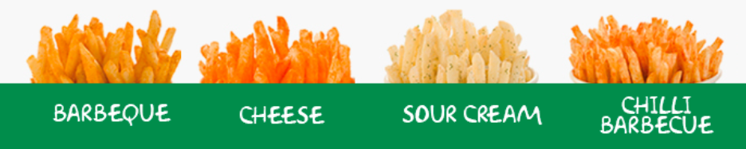
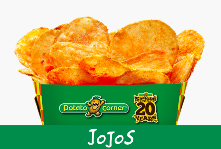
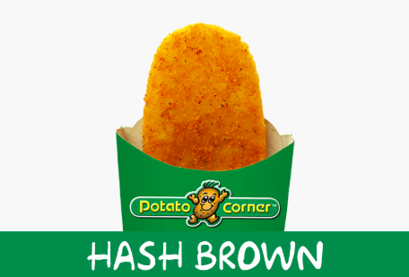
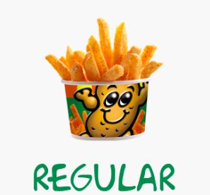
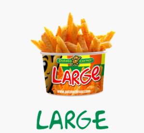
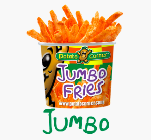
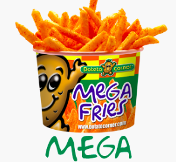
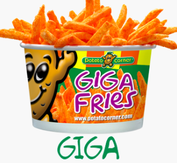
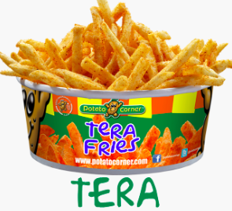

```{r setup, include=FALSE}
knitr::opts_chunk$set(echo = TRUE)
```

<style>
h4, h5{
  color: SeaGreen ;
  font-family: Verdana;
}

p {
  font-family: Verdana;
  font-size: 13px;
}

.graybg {
  background-color: WhiteSmoke  ;
}

.withPadding{
  padding:2%;
}
</style>
<br>
<br>
<h4 class="my-4" style=">POTATO CORNER MENU</h4>
<br>
<h5 class="my-4" style=">BEST FLAVORED FRIES</h5>
<div class="withPadding">
  
</div>


<h5 class="my-4" style=">FANCY FRIES</h5>

<div class="withPadding">
  
  
  
</div>

<h5 class="my-4" style=">SIZES</h5>

<div class="withPadding">
  
  
  
  <br>
  <br>
  
  
  
</div>
